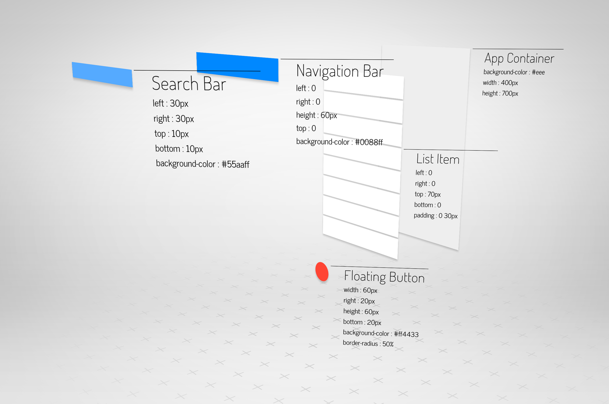
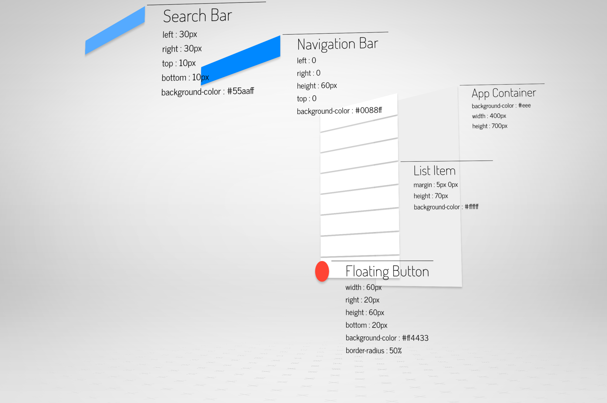
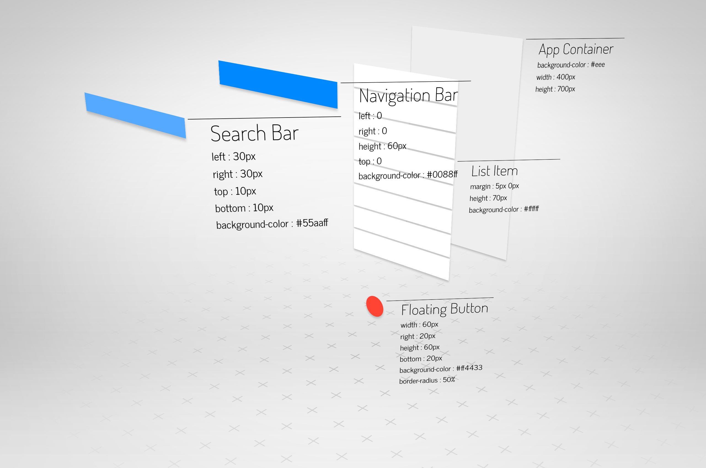

# Visual Exercise 1

Taking this assignment beyond requirements, I conceptualized what debugging would be like in a futuristic, interactive programming environment. If only programs could be built and inspected in an exploded view -- a way to expose their otherwise opaque inner workings -- debugging and programming would become one and the same, as a programmer could program in a rapid, fluid, hands-on manner akin to a mechanical engineer working with physical parts. This Visual Exercise only offers a snapshot of this potential means of programming, not yet a functional visual programming environment.

[View in Browser](http://willy-vvu.github.io/VisualExercise1/)

Click/tap to toggle 2D/3D. Move the mouse/drag your finger to rotate.

---

Assignment for: MAS.110 Computational Media Design

Learning Focus: Speculative Programming, Spatial Debugging, 3D Animation, Environment Building

Media: 3D Animation, Interactive, Website

Software: CSS3, JavaScript, GIMP

Date: September 2015
